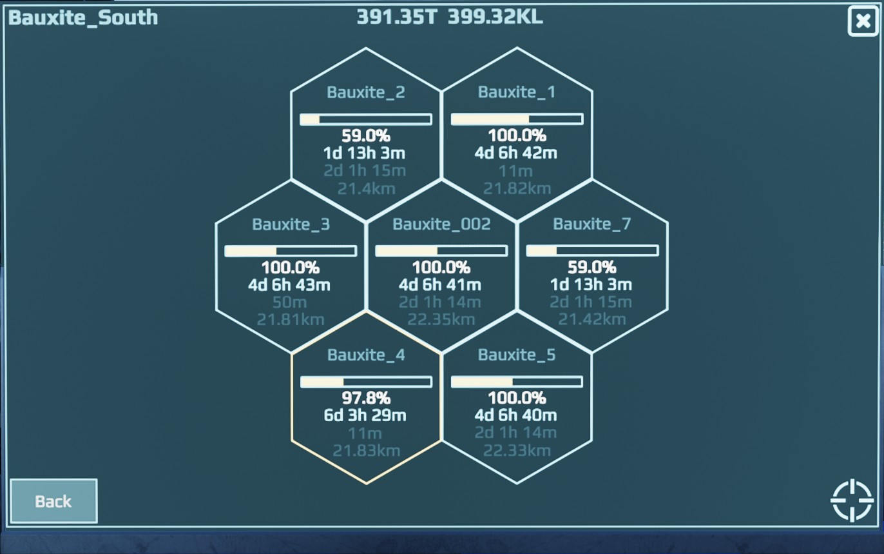
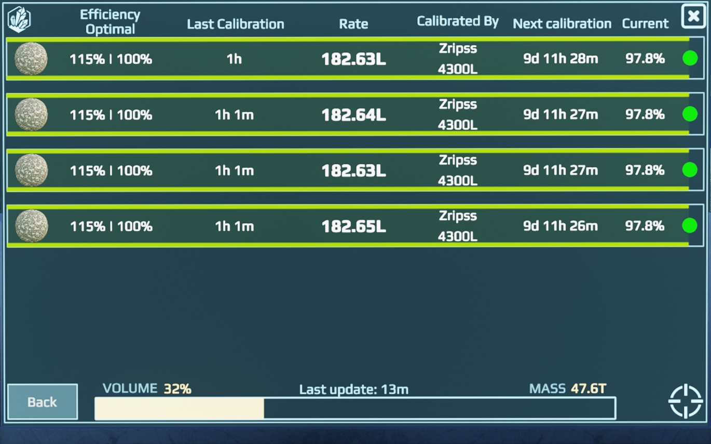

# MinerSuite

Quanta can be sent to Zripss :P

## Instalation

This is 2 part installation, one for the mining site where your miners are and one for your dynamic core, aka ship.

### Mining site setup
 You will need:
   * ProgramableBoard
   * Receiver
   * Emmiter

Copy/paste LUA code from [HERE](https://raw.githubusercontent.com/GcGoat/MinerSuite/main/MiningSiteLUA) into your Programmable board (PB), from PB link to all elements, which would be: receiver, emitter, container (or hub) and all mining units  

**Attention #1** You will need to link FROM receiver to PB in addition to linking PB to the receiver, it will have blue and green links between these 2 elements 

Now right-click PB and enter into "Edit Lua Parameters" there are 2 ESSENTIAL values you need to update
 * **flowerName** - this defines the entire mining flower with a unique name, this will allow us to group miners in the same area for simpler visualization
 * **emitterChannel** - is the unique name you came up with to separate your miners from everyone else, make it as unique as possible and keep it the same across all your mining sites  

**Attention #2** Mining site core name needs to be unique for this entire flower, so name it accordingly. You can use names like "Coal_1" (without quotes) and then a second one like "Coal_2". The format of the name isn't essential, but try to keep it short

### Ship setup
 You will need:
   * ProgramableBoard
   * Receiver
   * Emmiter
   * Screen (optional)
   * DataBank

Copy/paste the LUA code from [HERE](https://raw.githubusercontent.com/GcGoat/MinerSuite/main/ShipsPBLUA) into your Programmable board (PB). THE FIRST LINK goes to the receiver, the remaining can go in any order. So links from PB goes to: Receiver, Emmiter, Databank, and Screen.
  
**Attention #1** You will need to link FROM receiver to PB in addition to linking PB to the receiver, the same as it was for the mining site, it will have blue and green links between these 2 elements 
  
Now right-click PB and enter into "Edit Lua Parameters" there is only one ESSENTIAL value you need to update
 * **emitterChannel** - same channel name you used for mining sites
   
Additional options you need to adjust
* **containerProficiency** - value between 1 and 5 based on your talents levels
* **containerOptimization** - value between 1 and 5 based on your talents levels
  
Without providing correct values it will report incorrect container values, and will not affect the miner status
  
Optionally change **minimalCalibration** value to whatever value you want between 0 and 100. This determines the timer report when recalibration will be needed to keep it above the defined percentage amount. 

### Done
At this point you are fully set up and you can startup PB on your ship. The screen should be blank but turn on. Now you will only need to turn on Mining Site PB once, just turn it on and off. (At this time you will need to relaunch ships PB for the new mining site to appear).  
When that's done you should get AR mode on your screen showing detected miners and containers with their status. Repeat the Mining site setup for every mining site you have. This is a one-time setup, after that mining site status will be updated automatically each time you visit it to calibrate while having ship PB enabled. 

## Updating
When you update the script on your ship (miner sites will not need any updates, its fine as it is) receiver channel will be taken from a databank record automatically, so if it's updating the existing setup then you won't need to do anything in addition to overwriting existing LUA code. 

## Synchronization
  
You can synchronize mining sites status between 2 ship PBs, setup is the same for both ships, what you only need to do is turn both of them on (don't turn on the third one, it will derp out). When 2 ship PBs are on you will get a progress bar on your screen, this can repeat twice, after it's over you can turn off one of the PBs and you are done. Depending on the record amount this can take from a second to multiple ones, so just keep calm and enjoy the view while it's doing its thing.  

# Recommendation 
Have one central PB at your main org base which is used to synchronize the latest information between ships, so that everyone who does mining site calibrations can synchronize data before going to sites and after returning from those. If you are playing solo then this is not nesecerry. 

# Manual mode
At this moment in time, there is no way to update miners' status if you are visiting those over VR. This can be mitigated somewhat by using manual edit mode. Selecting the appropriate mining site you can click on the left top corner icon which will enable manual edit mode, and adjust calibration values by simply clicking and dragging the action and clicking on the save button. This will reset timers and record you as the last person who calibrated it. 

# Extra information
 * Main screen will list all mining flowers in the record. The top value indicates the miner count. Name of the flower. Timer when the soonest miner will need recalibration, it will be shown in blue if the time until recalibration is over 24 hours, in yellow if recalibration will be needed sooner than 24 hours and the word "Calibrate!" will be shown when calibration is under previously defined minimalCalibration value. The lowest minimal calibration will be shown at all times. And last value is the distance to this flower. The entire flower block can be enclosed with a double line which will indicate it being closest to you.
 * Secondary window shows all mining sites for that mining flower. At the top, you will see the predicted total ore amount in weight and volume. These values are being predicted, so the actual value can be slightly different. You will have the option to remove this flower by clicking in X, keep in mind that this would be needed to be done on all databases, otherwise, it will be readded with the next synchronization. A right bottom corner can be pressed to set the destination to this flower center point.
 * Mining site screen. The top left icon enables manual mode. The top right can remove mining sites from records. The bottom right sets the destination to it.
 * Main screen will have a lock symbol on the bottom right corner, this indicates if the databank is in a locked state or not. When it's locked then it will no longer accept new records for new flowers or mining sites, it will accept updates for existing ones. This can be useful to avoid accidental additions to an existing database. This can be locked/unlocked by modifying LUA settings

# AR mode
This mode will provide all the information you might need. You will see the locations of all mining flowers with their basic information. You can hover over any of these to get more detailed information about it. You can hover over it and mouse-click it to set the destination to it. Getting closer to mining flower will update its AR visualization with more and more detailed information. You can turn off AR mode by pressing ALT+3

# ToolTip

* Top line indicates the version of the code
* Followed by ship's name. This will change if you have second ships PB enabled to indicate a linkage between 2 cores
* Alt+1 shortcut will manually attempt to grab data from the closest mining sites. This is not needed to be done as it should be performed automatically, but you can try to synchronize data this way. Keep in mind that the mining site needs to be loaded in for it to work
* Alt+3 will toggle AR mode completely on and off
* Alt+4 will show or hide flowers that are not the closest one, so only one closest flower could be shown on the screen
* Alt+5 will hide all flowers on different planets
* Alt+9 will toggle off all previously mentioned keys on and off. Your options will be saved, so after picking what you want, disable their shortcuts to avoid compatibility issues with flight scripts like ArchHud

